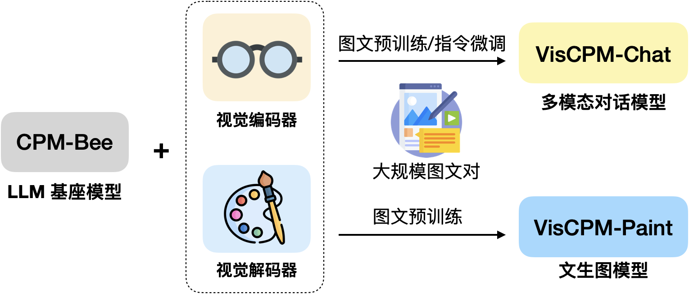
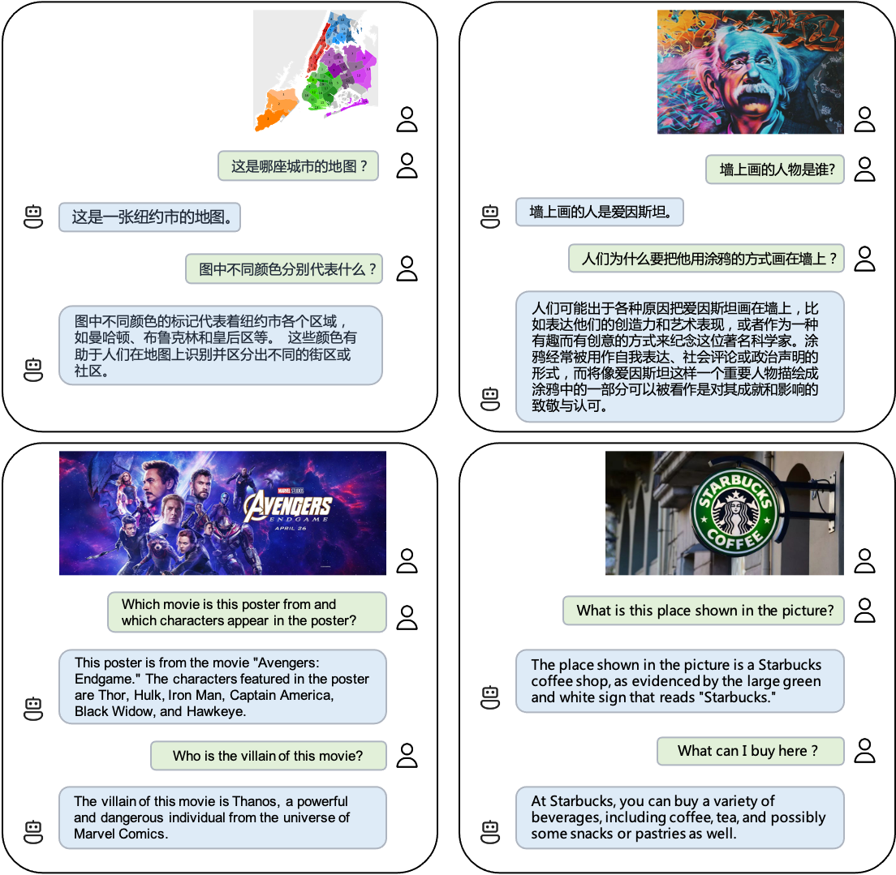

<div align="center">

# VisCPM
**基于CPM基础模型的中英双语多模态大模型系列**
<p align="center">
  <a href="#-viscpm-chat">多模态对话模型VisCPM-Chat</a> •
  <a href="#-viscpm-paint">文生图模型VisCPM-Paint</a> •
  <a href="#-使用">使用</a> •
  <a href="https://arxiv.org/pdf/2308.12038.pdf">论文</a>
</p>
<p>
  <a href="https://huggingface.co/spaces/openbmb/viscpm-chat">VisCPM-Chat Demo</a> •
  <a href="https://huggingface.co/spaces/openbmb/viscpm-paint">VisCPM-Paint Demo</a> •
  <a href="https://huggingface.co/openbmb/VisCPM-Chat"> VisCPM-Chat🤗 </a> •
  <a href="https://huggingface.co/openbmb/VisCPM-Paint"> VisCPM-Paint🤗 </a> •
  <a href="figures/wechat.md">加入微信讨论群</a>
</p>

<p align="center">
  简体中文 | <a href="README_en.md">English</a>
</p>
</div>

**`VisCPM`** is a family of open-source large multimodal models, which support multimodal conversational capabilities (`VisCPM-Chat` model) and text-to-image generation capabilities (`VisCPM-Paint` model) in both Chinese and English, achieving state-of-the-art performance among Chinese open-source multimodal models. VisCPM is trained based on the large language model [CPM-Bee](https://github.com/OpenBMB/CPM-Bee) with 10B parameters, fusing visual encoder (Muffin) and visual decoder (Diffusion-UNet) to support visual inputs and outputs. Thanks to the good bilingual capability of CPM-Bee, `VisCPM` can be pre-trained with English multimodal data only and well generalize to achieve promising Chinese multimodal capabilities.

**`VisCPM`** 是一个开源的多模态大模型系列，支持中英双语的多模态对话能力（`VisCPM-Chat`模型）和文到图生成能力（`VisCPM-Paint`模型），在中文多模态开源模型中达到最佳水平。VisCPM基于百亿参数量语言大模型[CPM-Bee](https://github.com/OpenBMB/CPM-Bee)（10B）训练，融合视觉编码器（Muffin）和视觉解码器（Diffusion-UNet）以支持视觉信号的输入和输出。得益于CPM-Bee基座优秀的双语能力，`VisCPM`可以仅通过英文多模态数据预训练，泛化实现优秀的中文多模态能力。

- **👐 开源使用**：VisCPM可以自由被用于个人和研究用途。我们希望通过开源VisCPM模型系列，推动多模态大模型开源社区和相关研究的发展。
- **🌟 涵盖图文双向生成**：VisCPM模型系列较为全面地支持了图文多模态能力，涵盖多模态对话（图到文生成）能力和文到图生成能力。
- **💫 中英双语性能优异**：得益于语言模型基座CPM-Bee优秀的双语能力，VisCPM在中英双语的多模态对话和文到图生成均取得亮眼的效果。

<div align="center">


</div>

## 📰 更新信息
`VisCPM`在持续升级中，近期我们支持了低资源推理、网页版部署等功能，并提供在线Demo供大家使用，未来我们会提供能力升级的更高版本的模型，欢迎大家持续关注！

- **[2023/09/06]** 🔌 VisCPM-Chat API 发布！现在您可以直接通过API轻松地使用VisCPM-Chat模型了。查看[API使用指南](#API使用指南)以了解更多详情。
- **[2023/08/23]** 📑 VisCPM论文发布：[Large Multilingual Models Pivot Zero-Shot Multimodal Learning across Languages](https://arxiv.org/pdf/2308.12038.pdf)，论文提供了更详细的实现细节和实验结果
- **[2023/08/18]** ⤴️ [VisCPM-Chat-v1.1](#模型下载)版本发布，带来更强的细节理解和复杂推理能力！
- **[2023/08/18]** 🛠️ 支持[微调](#模型微调)，让VisCPM更适配你的应用场景！
- **[2023/07/20]** 🌐 发布VisCPM-[Chat](https://huggingface.co/spaces/openbmb/viscpm-chat)和[VisCPM-Paint](https://huggingface.co/spaces/openbmb/viscpm-paint) 的在线Demo，欢迎尝试！
- **[2023/07/20]** 🎢 支持一键[部署本地网页版Demo](#demo部署)
- **[2023/07/20]** ⚡️ 支持[低资源推理](#低资源推理)，最低5G显存运行多模态对话模型！
- **[2023/07/18]** 🤗 [VisCPM-Chat](https://huggingface.co/openbmb/VisCPM-Chat)和[VisCPM-Paint](https://huggingface.co/openbmb/VisCPM-Paint) 已整合到Huggingface框架中

##  VisCPM-Chat
`VisCPM-Chat`支持面向图像进行中英双语多模态对话。该模型使用`Muffin`视觉编码架构，使用CPM-Bee（10B）作为语言基座模型，并通过语言建模训练目标融合视觉和语言模型。模型训练包括预训练和指令精调两阶段：

* 预训练：我们使用约100M高质量英文图文对数据对`VisCPM-Chat`进行了预训练，数据包括CC3M、CC12M、COCO、Visual Genome、Laion等。在预训练阶段，语言模型参数保持固定，仅更新视觉编码器的参数，以支持大规模视觉-语言表示的高效对齐。

* 指令精调：我们采用[LLaVA-150K](https://llava-vl.github.io/)英文指令精调数据，并混合相应[翻译后的中文数据](https://huggingface.co/datasets/openbmb/llava_zh)对模型进行指令精调，以对齐模型多模态基础能力和用户使用意图。在指令精调阶段，我们更新全部模型参数，以提升指令精调数据的利用效率。有趣的是，我们发现即使仅采用英文指令数据进行指令精调，模型也可以理解中文问题，但仅能用英文回答。这表明模型的多语言多模态能力已经得到良好的泛化。在指令精调阶段进一步加入少量中文翻译数据，可以将模型回复语言和用户问题语言对齐。

我们在[LLaVA标准英文测试集](https://huggingface.co/datasets/liuhaotian/LLaVA-Instruct-150K)和翻译的[中文测试集](data/translated_LLaVA_qa90)对模型进行了评测，该评测基准考察模型在开放域对话、图像细节描述、复杂推理方面的表现，并使用GPT-4进行打分。可以观察到，`VisCPM-Chat`在中文多模态能力方面取得了最佳的平均性能，在通用域对话和复杂推理表现出色，同时也表现出了不错的英文多模态能力。我们提供了两个模型版本，分别为`VisCPM-Chat-balance`和`VisCPM-Chat-zhplus`，前者在英文和中文两种语言上的能力较为平衡，后者在中文能力上更加突出。两个模型在指令精调阶段使用的数据相同，`VisCPM-Chat-zhplus`在预训练阶段额外加入了20M清洗后的原生中文图文对数据和120M翻译到中文的图文对数据。`VisCPM-Chat-v1.1`在指令精调阶段额外加入了[UniMM-Chat](https://huggingface.co/datasets/Yirany/UniMM-Chat)多模态指令精调数据集。

<table>
    <tr>
        <td align="center" rowspan="2" colspan="2">模型</td>
        <td align="center" rowspan="2">语言模型基座</td>
        <td align="center" colspan="4">英文</td>
        <td align="center" colspan="4">中文</td>
    </tr>
    <tr>
        <td align="center">对话</td>
        <td align="center">精细描述</td>
        <td align="center">复杂推理</td>
        <td align="center">平均</td>
        <td align="center">对话</td>
        <td align="center">精细描述</td>
        <td align="center">复杂推理</td>
        <td align="center">平均</td>
    </tr>
    <tr>
        <td align="center" rowspan="3">英文模型</td>
        <td align="center">MiniGPT4</td>
        <td align="center">Vicuna-13B</td>
        <td align="center">65.0</td>
        <td align="center">67.3</td>
        <td align="center">76.6</td>
        <td align="center">69.7</td>
        <td align="center">-</td>
        <td align="center">-</td>
        <td align="center">-</td>
        <td align="center">-</td>
    </tr>
    <tr>
        <td align="center">InstructBLIP</td>
        <td align="center">Vicuna-13B</td>
        <td align="center">81.9</td>
        <td align="center">68.0</td>
        <td align="center">91.2</td>
        <td align="center">80.5</td>
        <td align="center">-</td>
        <td align="center">-</td>
        <td align="center">-</td>
        <td align="center">-</td>
    </tr>
    <tr>
        <td align="center">LLaVA</td>
        <td align="center">Vicuna-13B</td>
        <td align="center"><b><span style="color:#c00000;">89.5</span></b></td>
        <td align="center"><b><span style="color:#c00000;">70.4</span></b></td>
        <td align="center">96.2</td>
        <td align="center"><b><span style="color:#c00000;">85.6</span></b></td>
        <td align="center">-</td>
        <td align="center">-</td>
        <td align="center">-</td>
        <td align="center">-</td>
    </tr>
    <tr>
        <td align="center" rowspan="6">中英双语模型</td>
        <td align="center">mPLUG-Owl </td>
        <td align="center">LLaMA-7B</td>
        <td align="center">64.6</td>
        <td align="center">47.7</td>
        <td align="center">80.1</td>
        <td align="center">64.2</td>
        <td align="center">76.3</td>
        <td align="center">61.2</td>
        <td align="center">77.8</td>
        <td align="center">72.0</td>
    </tr>
    <tr>
        <td align="center">VisualGLM</td>
        <td align="center">ChatGLM-6B</td>
        <td align="center">62.4</td>
        <td align="center">63.0</td>
        <td align="center">80.6</td>
        <td align="center">68.7</td>
        <td align="center">76.6</td>
        <td align="center">87.8</td>
        <td align="center">83.6</td>
        <td align="center">82.7</td>
    </tr>
    <tr>
        <td align="center">Ziya-Visual </td>
        <td align="center">Ziya-LLaMA-13B-v1</td>
        <td align="center">82.7</td>
        <td align="center">69.9</td>
        <td align="center">92.1</td>
        <td align="center">81.7</td>
        <td align="center">85.0</td>
        <td align="center">74.7</td>
        <td align="center">82.4</td>
        <td align="center">80.8</td>
    </tr>
    <tr>
        <td align="center">VisCPM-Chat-balance</td>
        <td align="center">CPMBee-10B</td>
        <td align="center">83.3</td>
        <td align="center">68.9</td>
        <td align="center">90.5</td>
        <td align="center">81.1</td>
        <td align="center"><b><span style="color:#c00000;">92.7</span></b></td>
        <td align="center">76.1</td>
        <td align="center">89.2</td>
        <td align="center">86.3</td>
    </tr>
    <tr>
        <td align="center">VisCPM-Chat-zhplus</td>
        <td align="center">CPMBee-10B</td>
        <td align="center">80.1</td>
        <td align="center">65.7</td>
        <td align="center">92.5</td>
        <td align="center">79.6</td>
        <td align="center">90.3</td>
        <td align="center">81.4</td>
        <td align="center">92.1</td>
        <td align="center">88.2</td>
    </tr>
    <tr>
        <td align="center">VisCPM-Chat-v1.1</td>
        <td align="center">CPMBee-10B</td>
        <td align="center">80.1</td>
        <td align="center">67.1</td>
        <td align="center"><b><span style="color:#c00000;">97.1</span></b></td>
        <td align="center">81.5</td>
        <td align="center">91.3</td>
        <td align="center"><b><span style="color:#c00000;">90.7</span></b></td>
        <td align="center"><b><span style="color:#c00000;">95.4</span></b></td>
        <td align="center"><b><span style="color:#c00000;">92.5</span></b></td>
    </tr>
</table>



##  VisCPM-Paint
`VisCPM-Paint`支持中英双语的文到图生成。该模型使用CPM-Bee（10B）作为文本编码器，使用`UNet`作为图像解码器，并通过扩散模型训练目标融合语言和视觉模型。在训练过程中，语言模型参数始终保持固定。我们使用[Stable Diffusion 2.1](https://github.com/Stability-AI/stablediffusion)的UNet参数初始化视觉解码器，并通过逐步解冻其中关键的桥接参数将其与语言模型融合。该模型在[LAION 2B](https://laion.ai/)英文图文对数据上进行了训练。

与`VisCPM-Chat`类似，我们发现得益于CPM-Bee的双语能力，`VisCPM-Paint`可以仅通过英文图文对训练，泛化实现良好的中文文到图生成能力，达到中文开源模型的最佳效果。通过进一步加入20M清洗后的原生中文图文对数据，以及120M翻译到中文的图文对数据，模型的中文文到图生成能力可以获得进一步提升。我们在标准图像生成测试集MSCOCO上采样了3万张图片，计算了常用评估图像生成指标FID (Fréchet Inception Distance)评估生成图片的质量。我们同样提供了两个模型版本，分别为`VisCPM-Paint-balance`和`VisCPM-Paint-zhplus`，前者在英文和中文两种语言上的能力较为平衡，后者在中文能力上更加突出。`VisCPM-Paint-balance`只使用了英文图文对进行训练，`VisCPM-Paint-zhplus`在`VisCPM-Paint-balance`基础上增加了20M原生中文图文对数据和120M翻译到中文的图文对数据进行训练。

<table align="center">
    <tr>
        <td align="center" rowspan="2">模型</td>
        <td align="center" colspan="2">Zero-shot FID↓</td>
    </tr>
    <tr>
        <td align="center">英文</td>
        <td align="center">中文</td>
    </tr>
    <tr>
        <td align="center">GLIDE</td>
        <td align="center">12.2</td>
        <td align="center">-</td>
    </tr>
    <tr>
        <td align="center">Make-A-Scene</td>
        <td align="center">11.8</td>
        <td align="center">-</td>
    </tr>
    <tr>
        <td align="center">DALL·E-2</td>
        <td align="center">10.4</td>
        <td align="center">-</td>
    </tr>
    <tr>
        <td align="center">Unidiffuser</td>
        <td align="center">9.7</td>
        <td align="center">-</td>
    </tr>
    <tr>
        <td align="center">Cogview2</td>
        <td align="center">-</td>
        <td align="center">24.0</td>
    </tr>
    <tr>
        <td align="center">Stable Diffusion</td>
        <td align="center"><b><span style="color:#c00000;">8.6</span></b></td>
        <td align="center">-</td>
    </tr>
    <tr>
        <td align="center">AltDiffusion</td>
        <td align="center">17.2</td>
        <td align="center">16.1</td>
    </tr>
    <tr>
        <td align="center">TaiyiDiffusion</td>
        <td align="center">-</td>
        <td align="center">15.6</td>
    </tr>
    <tr>
        <td align="center">VisCPM-Paint-balance</td>
        <td align="center">9.5</td>
        <td align="center">10.9</td>
    </tr>
    <tr>
        <td align="center">VisCPM-Paint-zhplus</td>
        <td align="center">9.9</td>
        <td align="center"><b><span style="color:#c00000;">9.6</span></b></td>
    </tr>
</table>

## ⚙️ 安装
1. 克隆仓库并进入源码目录
```bash
git clone https://github.com/OpenBMB/VisCPM.git
cd VisCPM
```

2. 创建conda环境
```Shell
conda create -n viscpm python=3.10 -y
conda activate viscpm
```

3. 安装依赖
   
```shell
pip install torch>=1.10
pip install -r requirements.txt
```

## 💡 使用
### 模型下载
| 模型                   | 描述                         | 下载链接 |
|----------------------|-------------------|------     |
| VisCPM-Chat-v1.1     | 新版本多模态对话模型，强化了细节理解和复杂推理能力  |     [链接](https://huggingface.co/openbmb/VisCPM-Chat/blob/main/pytorch_model.v1.bin)    |
| VisCPM-Chat-balance  | 中英文能力较为平衡的多模态对话模型  |     [链接](https://huggingface.co/openbmb/VisCPM-Chat/resolve/main/pytorch_model.bin)    |
| VisCPM-Chat-zhplus   | 中文能力突出的多模态对话模型       |     [链接](https://huggingface.co/openbmb/VisCPM-Chat/resolve/main/pytorch_model.zhplus.bin)   |
| VisCPM-Paint-balance | 中英文能力较为平衡的文生图模型     |      [链接](https://huggingface.co/openbmb/VisCPM-Paint/resolve/main/pytorch_model.balance.bin) |
| VisCPM-Paint-zhplus  | 中文能力突出的文生图模型          |      [链接](https://huggingface.co/openbmb/VisCPM-Paint/resolve/main/pytorch_model.bin)  |


### VisCPM-Chat
在下载模型权重后，可以使用如下代码运行VisCPM-Chat（`'/path/to/checkpoint'`改为模型存放路径）

#### 单轮对话

<div align="center">

</div>

VisCPM-Chat可以通过几行代码实现多模态对话，我们在代码中默认开启了对输入图片的安全检查。
```shell
# 如果您单卡显存不足40G，可以引入如下环境变量并将安全模块开关关闭。引入后显存占用约为5G，但推理所需时间会变长。此选项依赖BMInf，需要安装BMInf依赖库。
export CUDA_MEMORY_CPMBEE_MAX=1g
```
```python
from VisCPM import VisCPMChat
from PIL import Image

model_path = '/path/to/checkpoint'
viscpm_chat = VisCPMChat(model_path, image_safety_checker=True)
# 默认开启对输入图片的安全检查
image_path = 'figures/vlu_case1.png'
image = Image.open(image_path).convert("RGB")

question = '如果用一句中国唐代的著名诗人"李白"的古诗来描述这幅图像，你能想到什么？'
answer, _, _ = viscpm_chat.chat(image, question)

print(answer)
```
可得到如下结果
```
“黄河之水天上来，奔流到海不复回。” 李白的这句诗可以用来形容这幅图片中汹涌澎湃、波涛汹涌的景象：一条湍急的河流从山上奔腾而下，形成了一幅令人叹为观止的画面，展示出大自然的力量和雄伟壮丽。
```

#### 多轮对话
<div align="center">


</div>

```python
from VisCPM import VisCPMChat
from PIL import Image

model_path = '/path/to/checkpoint'
viscpm_chat = VisCPMChat(model_path, image_safety_checker=True)
# 默认开启对输入图片的安全检查
image_path = 'figures/vlu_case2.jpeg'
image = Image.open(image_path).convert("RGB")

question = '这幅图像是在哪个节日拍摄的？'
answer, context, vision_hidden_states = viscpm_chat.chat(image, question)

# 多轮对话传入历史 context
question = '你能用什么古诗描述这幅画？'
answer, context, _ = viscpm_chat.chat(image, question, context, vision_hidden_states=vision_hidden_states)

print(context)
```

可得到如下结果
```
User: 这幅图像是在哪个节日拍摄的？
AI: 这幅图像是在中秋节拍摄的， 也就是中国传统节日中的月圆之夜。
User: 你能用什么古诗描述这幅画？
AI: “明月几时有，把酒问青天。” 这是苏轼的《水调歌头》中的一句诗，用来形容这幅图片再贴切不过了：在中秋之夜，月亮高高地挂在天空中，一座古老的建筑沐浴着月光，营造出一种宁静祥和的气氛。
```


#### API使用指南
我们提供了API接口，可以通过如下代码轻松体验VisCPM-Chat。API接口支持的输入格式和使用方式如下：
```python
import requests
import base64

url = "http://34.143.180.202:3389/viscpm"
resp = requests.post(url, json={
    # need to modify
    "image": base64.b64encode(open("path/to/image", "rb").read()).decode(),
    "question": "描述一下这张图片",
})
resp = resp.json()
print(resp)
```

### VisCPM-Paint
在下载模型权重后，可以使用如下代码运行VisCPM-Paint（`'/path/to/checkpoint'`改为模型存放路径）。


生成上面图片的文本输入可参考[prompts.txt](data/prompts.txt)。
```shell
# 如果您单卡显存不足40G，可以引入如下环境变量并将安全模块开关关闭。引入后显存占用约为17G，但推理所需时间会变长。此选项依赖BMInf，需要安装BMInf依赖库。
export CUDA_MEMORY_CPMBEE_MAX=1g
```
```python
from VisCPM import VisCPMPaint
painter = VisCPMPaint('/path/to/checkpoint', image_safety_checker=True, prompt_safety_checker=True, add_ranker=True) 
# 默认对输入的文本和输出的图片进行安全检查，默认开启重排序
image = painter.generate('人闲桂花落，月静春山空') # 对应上图第一行第二张图片
image.save('/data/test.png') 
```

我们在代码中默认开启了对输入文本和输出图片的安全检查。

同时，我们默认对生成的图像使用重排序，即对同一个输入，同时生成4张图片，返回与输入相关性最高的1张图片，相关性通过[Chinese-Clip](https://github.com/OFA-Sys/Chinese-CLIP)进行打分。重排序可以提升生成图片质量的稳定性，但也会降低模型的生成速度，如希望快速得到生成结果，可以关闭重排序机制。

VisCPM-Paint目前使用中文模型进行重排序打分，如果输入英文生成图片，请关闭重排序机制和输入文本检查模块。

### 低资源推理

为了支持更加高效的低资源推理场景，我们借助[BMInf](https://github.com/OpenBMB/BMInf)工具支持更低的显存需求。首先安装BMInf依赖`pip install bminf`，然后在命令行中指定`export CUDA_MEMORY_CPMBEE_MAX=1g`（具体数值可以根据个人需求设定），然后按照上述步骤进行推理，VisCPM-Chat最低显存占用可以降至5G，VisCPM-Paint最低显存占用可以降至17G。

### Demo部署

我们提供简易的基于gradio的网页版Demo，首先安装gradio:`pip install gradio`，然后执行如下命令：
```shell
git clone https://github.com/OpenBMB/VisCPM.git
cd VisCPM
python demo_chat.py # viscpm_chat demo, or
python demo_paint.py # viscpm_paint demo
```

### 模型微调
为适应特定场景下的需求, 我们提供了VisCPM-Chat模型的微调代码，用户可以在私有数据上进行微调。微调代码位于`./finetune/ft_viscpm_chat`目录下，具体的微调代码使用方法如下：
```shell
# 获取数据集
bash ./finetune/ft_viscpm_chat/get_llava150k_zh.sh
# 模型微调, 注意修改其中的数据集与模型checkpoint路径
bash ./finetune/ft_viscpm_chat/run_viscpm_chat_ft.sh
# node: 8
# batch_size: 8 * 1
# 其他配置可参考'./finetune/ft_viscpm_chat/config/viscpm_chat_ft.json'与'./finetune/ft_viscpm_chat/run_viscpm_chat_ft.sh'
```
注: 
- 微调代码中使用了deepspeed-0.9.1配置训练环境，配置方法可以参考此[链接](https://www.deepspeed.ai/getting-started/)。
- 目前微调代码仅在linux系统下测试，如果您在其他系统配置下进行微调，可能需要修改部分代码。

## 🛡 安全

### 安全声明
作为多模态模型，`VisCPM`通过学习大量的公开图文数据来生成内容，但它无法理解、表达个人观点或价值判断，它所输出的任何内容都不代表模型开发者的观点和立场。因此用户在使用VisCPM生成的内容时，应自行负责对其进行评估和验证。

### 安全模块
为了帮助用户防止模型处理或生成不符合普遍社会价值观的内容，我们在`VisCPM`中加入了内容安全保障模块。当安全模块检测到模型处理或生成的图像文本内容不符合安全规范时，会对相应内容进行拦截。我们对`VisCPM-Chat`接受的图片输入以及`VisCPM-Paint`接受的文字输入和图片输出进行了安全检查。VisCPM的安全模块仍然不完美，可能会出现漏判和误判的情况。我们会在未来进一步提升安全模块的性能。


## 📝 开源协议

VisCPM系列模型采用协议为["通用模型许可协议-来源说明-宣传限制-非商业化"](https://github.com/OpenBMB/General-Model-License/blob/main/%E9%80%9A%E7%94%A8%E6%A8%A1%E5%9E%8B%E8%AE%B8%E5%8F%AF%E5%8D%8F%E8%AE%AE-%E6%9D%A5%E6%BA%90%E8%AF%B4%E6%98%8E-%E5%AE%A3%E4%BC%A0%E9%99%90%E5%88%B6-%E9%9D%9E%E5%95%86%E4%B8%9A%E5%8C%96.md)，允许个人使用和研究用途。如需将模型用于商业用途，请联系cpm@modelbest.cn来洽谈商业授权事宜。

CPM-Bee基座采用协议为[“通用模型许可协议-来源说明-宣传限制-商业授权”](https://github.com/OpenBMB/General-Model-License/blob/main/%E9%80%9A%E7%94%A8%E6%A8%A1%E5%9E%8B%E8%AE%B8%E5%8F%AF%E5%8D%8F%E8%AE%AE-%E6%9D%A5%E6%BA%90%E8%AF%B4%E6%98%8E-%E5%AE%A3%E4%BC%A0%E9%99%90%E5%88%B6-%E5%95%86%E4%B8%9A%E6%8E%88%E6%9D%83.md)，允许商用，如需将模型用于商业用途，请联系cpm@modelbest.cn来获取书面授权。


## ✅ TODO

- [ ] 支持模型量化功能，降低推理成本

## 🏫 机构

此项目由以下机构联合研发：

-  [清华自然语言处理实验室](https://nlp.csai.tsinghua.edu.cn/)
-  [面壁智能](https://modelbest.cn/)
-  [知乎](https://www.zhihu.com/)

## 引用
如果我们的工作对你有帮助的话，请考虑引用以下论文
```bibtex
@article{viscpm,
    title={Large Multilingual Models Pivot Zero-Shot Multimodal Learning across Languages}, 
    author={Jinyi Hu and Yuan Yao and Chongyi Wang and Shan Wang and Yinxu Pan and Qianyu Chen and Tianyu Yu and Hanghao Wu and Yue Zhao and Haoye Zhang and Xu Han and Yankai Lin and Jiao Xue and Dahai Li and Zhiyuan Liu and Maosong Sun},
    year={2023},
    eprint={2308.12038},
    archivePrefix={arXiv},
    primaryClass={cs.CL}
}
```
