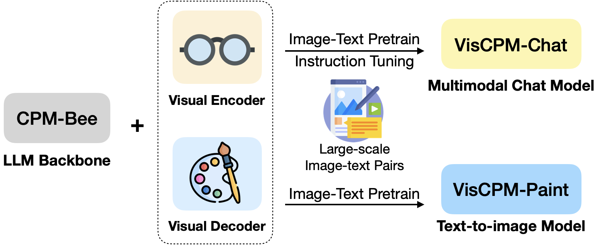

<div align="center">

# VisCPM
**Chinese-English bilingual multi-modal large model series based on CPM (Chinese Pretrained Models) basic model**
<p align="center">
  <a href="#-viscpm-chat">Multimodal Conversation Model VisCPM-Chat</a> •
  <a href="#-viscpm-paint">Text-to-image Model VisCPM-Paint</a> •
  <a href="#-inference">Inference</a> •
  <a href="#-license">License</a> • 
  <a href="figures/wechat.md">Join Wechat Group</a>
</p>

<p align="center">
  <a href="README.md">简体中文</a> | English
</p>
</div>

`VisCPM` is a family of open-source large multimodal models, which support multimodal conversational capabilities (`VisCPM-Chat` model) and text-to-image generation capabilities (`VisCPM-Paint` model) in both Chinese and English, achieving state-of-the-art peformance among Chinese open-source multimodal models. VisCPM is trained based on the large language model [CPM-Bee](https://github.com/OpenBMB/CPM-Bee) with 10B parameters, fusing visual encoder (Q-Former) and visual decoder (Diffusion-UNet) to support visual inputs and outputs. Thanks to the good bilingual capability of CPM-Bee, `VisCPM` can be pre-trained with English multimodal data only and well generalize to achieve promising Chinese multimodal capabilities.

- **👐 Open-source Usage**: VisCPM is free to be used for personal and research purposes. By open-sourcing the VisCPM model family, we hope to promote the development of the open-source community of large multimodal models and related research.
- **🌟 Image and text generation coverage**: VisCPM models provide relatively comprehensive support for image and text multimodal capabilities, covering both multimodal conversation (image-to-text generation) capabilities and text-to-image generation capabilities.
- **💫 Excellent bilingual performance**: Thanks to the excellent bilingual capability of the base language model CPM-Bee, VisCPM achieves outstanding results in both bilingual multimodal conversation and text-to-image generation.

<div align="center">

</div>

##  VisCPM-Chat
`VisCPM-Chat` supports bilingual multimodal conversations involving images in both Chinese and English. The model utilizes `Q-Former` as the visual encoder and `CPM-Bee` (10B) as the base LLM. It combines visual and language models and is optimized with the language modeling training objective. The model training consists of two stages: pretraining and instruction tuning.

* Pretraining: `VisCPM-Chat` is pretrained using approximately 100M high-quality English text-image pairs. The data sources include CC3M, CC12M, COCO, Visual Genome, Laion, etc. In this stage, the language model parameters remain fixed, and only the parameters of the `Q-Former` are updated to enable efficient alignment of vision and language representations.

* Instruction Tuning: We utilize the [LLaVA-150K](https://llava-vl.github.io/) dataset that contains English multimodal instruction-following data. We mix this data with corresponding [translated Chinese data](https://huggingface.co/datasets/openbmb/llava_zh) to fine-tune the model and align its multimodal capabilities with user intents. In this stage, we update all model parameters to improve the data efficiency of instruction tuning. Interestingly, we observe that even when using only English instruction data for fine-tuning, the model can well comprehend Chinese questions but can only respond in English. This indicates that the model has achieved good generalization in terms of its multilingual and multimodal capabilities. By incorporating a small amount of translated Chinese data during the instruction tuning stage, we can align the model's response language with the user's question language.

We evaluate the model on the standard [LLaVA English test set](https://huggingface.co/datasets/liuhaotian/LLaVA-Instruct-150K) and the translated [Chinese test set](data/translated_LLaVA_qa90) from the standard English test set. The evaluation benchmark examines the model's performance in conversation, detailed description, and complex reasoning, and uses GPT-4 for scoring. It can be observed that `VisCPM-Chat` achieves the best average performance in Chinese multimodal capabilities, excelling in conversation and complex reasoning, while also demonstrating good English multimodal capabilities. We provide two versions of the model, namely `VisCPM-Chat-balance` and `VisCPM-Chat-zhplus`. The former has a balanced ability in both English and Chinese, while the latter has a stronger emphasis on Chinese proficiency. Both models use the same data during the instruction tuning stage. `VisCPM-Chat-zhplus` additionally incorporates 20M cleaned native Chinese text-image pairs and 120M translated text-image pairs in Chinese during the pretraining stage.

<table>
    <tr>
        <td align="center" rowspan="2" colspan="2">Model</td>
        <td align="center" rowspan="2">LLM Backbone</td>
        <td align="center" colspan="4">English</td>
        <td align="center" colspan="4">Chinese</td>
    </tr>
    <tr>
        <td align="center">Conversation</td>
        <td align="center">Detailed Description</td>
        <td align="center">Complex Reasoning</td>
        <td align="center">Avg</td>
        <td align="center">Conversation</td>
        <td align="center">Detailed Description</td>
        <td align="center">Complex Reasoning</td>
        <td align="center">Avg</td>
    </tr>
    <tr>
        <td align="center" rowspan="3">English Model</td>
        <td align="center">MiniGPT4</td>
        <td align="center">Vicuna-13B</td>
        <td align="center">65.0</td>
        <td align="center">67.3</td>
        <td align="center">76.6</td>
        <td align="center">69.7</td>
        <td align="center">-</td>
        <td align="center">-</td>
        <td align="center">-</td>
        <td align="center">-</td>
    </tr>
    <tr>
        <td align="center">InstructBLIP</td>
        <td align="center">Vicuna-13B</td>
        <td align="center">81.9</td>
        <td align="center">68.0</td>
        <td align="center">91.2</td>
        <td align="center">80.5</td>
        <td align="center">-</td>
        <td align="center">-</td>
        <td align="center">-</td>
        <td align="center">-</td>
    </tr>
    <tr>
        <td align="center">LLaVA</td>
        <td align="center">Vicuna-13B</td>
        <td align="center"><b><span style="color:#c00000;">89.5</span></b></td>
        <td align="center"><b><span style="color:#c00000;">70.4</span></b></td>
        <td align="center"><b><span style="color:#c00000;">96.2</span></b></td>
        <td align="center"><b><span style="color:#c00000;">85.6</span></b></td>
        <td align="center">-</td>
        <td align="center">-</td>
        <td align="center">-</td>
        <td align="center">-</td>
    </tr>
    <tr>
        <td align="center" rowspan="5">En-Zh Bilingual Model</td>
        <td align="center">mPLUG-Owl </td>
        <td align="center">LLaMA-7B</td>
        <td align="center">64.6</td>
        <td align="center">47.7</td>
        <td align="center">80.1</td>
        <td align="center">64.2</td>
        <td align="center">76.3</td>
        <td align="center">61.2</td>
        <td align="center">77.8</td>
        <td align="center">72.0</td>
    </tr>
    <tr>
        <td align="center">VisualGLM</td>
        <td align="center">ChatGLM-6B</td>
        <td align="center">62.4</td>
        <td align="center">63.0</td>
        <td align="center">80.6</td>
        <td align="center">68.7</td>
        <td align="center">76.6</td>
        <td align="center"><b><span style="color:#c00000;">87.8</span></b></td>
        <td align="center">83.6</td>
        <td align="center">82.7</td>
    </tr>
    <tr>
        <td align="center">Ziya-Visual </td>
        <td align="center">Ziya-LLaMA-13B-v1</td>
        <td align="center">82.7</td>
        <td align="center">69.9</td>
        <td align="center">92.1</td>
        <td align="center">81.7</td>
        <td align="center">85.0</td>
        <td align="center">74.7</td>
        <td align="center">82.4</td>
        <td align="center">80.8</td>
    </tr>
    <tr>
        <td align="center">VisCPM-Chat-balance</td>
        <td align="center">CPMBee-10B</td>
        <td align="center">83.3</td>
        <td align="center">68.9</td>
        <td align="center">90.5</td>
        <td align="center">81.1</td>
        <td align="center"><b><span style="color:#c00000;">92.7</span></b></td>
        <td align="center">76.1</td>
        <td align="center">89.2</td>
        <td align="center">86.3</td>
    </tr>
    <tr>
        <td align="center">VisCPM-Chat-zhplus</td>
        <td align="center">CPMBee-10B</td>
        <td align="center">80.1</td>
        <td align="center">65.7</td>
        <td align="center">92.5</td>
        <td align="center">79.6</td>
        <td align="center">90.3</td>
        <td align="center">81.4</td>
        <td align="center"><b><span style="color:#c00000;">92.1</span></b></td>
        <td align="center"><b><span style="color:#c00000;">88.2</span></b></td>
    </tr>
</table>

##  VisCPM-Paint
`VisCPM-Paint` supports bilingual text-to-image generation. The model uses `CPM-Bee` as the text encoder, `UNet` as the image decoder, and fuses vision and language models using the objective of diffusion model. During the training process, the parameters of the language model remain fixed. The visual decoder is initialized with the parameters of [Stable Diffusion 2.1](https://github.com/Stability-AI/stablediffusion), and it is fused with the language model by gradually unfreezing key bridging parameters. The model is trained on the [LAION 2B](https://laion.ai/) English text-image pair dataset.

Similar to `VisCPM-Chat`, we found that due to the bilingual capability of `CPM-Bee`, `VisCPM-Paint` can achieve good Chinese text-to-image generation by training only on English text-image pairs, surpassing the performance of Chinese open-source models. By incorporating an additional 20M cleaned native Chinese text-image pairs and 120M translated text-image pairs in Chinese, the model's Chinese text-to-image generation ability can be further improved. We sample 30,000 images from the standard image generation test set MSCOCO and calculated commonly used evaluation metrics FID (Fréchet Inception Distance) to assess the quality of generated images. Similarly, we provide two versions of the model, namely `VisCPM-Paint-balance` and `VisCPM-Paint-zhplus`. The former has a balanced ability in both English and Chinese, while the latter emphasizes Chinese proficiency. `VisCPM-Paint-balance` is trained only using English text-image pairs, while `VisCPM-Paint-zhplus` incorporates an additional 20M native Chinese text-image pairs and 120M translated text-image pairs in Chinese based on `VisCPM-Paint-balance`.

<table align="center">
    <tr>
        <td align="center" rowspan="2">Model</td>
        <td align="center" colspan="2">Zero-shot FID↓</td>
    </tr>
    <tr>
        <td align="center">English</td>
        <td align="center">Chinese</td>
    </tr>
    <tr>
        <td align="center">GLIDE</td>
        <td align="center">12.2</td>
        <td align="center">-</td>
    </tr>
    <tr>
        <td align="center">Make-A-Scene</td>
        <td align="center">11.8</td>
        <td align="center">-</td>
    </tr>
    <tr>
        <td align="center">DALL·E-2</td>
        <td align="center">10.4</td>
        <td align="center">-</td>
    </tr>
    <tr>
        <td align="center">Unidiffuser</td>
        <td align="center">9.7</td>
        <td align="center">-</td>
    </tr>
    <tr>
        <td align="center">Cogview2</td>
        <td align="center">-</td>
        <td align="center">24.0</td>
    </tr>
    <tr>
        <td align="center">Stable Diffusion</td>
        <td align="center"><b><span style="color:#c00000;">8.6</span></b></td>
        <td align="center">-</td>
    </tr>
    <tr>
        <td align="center">AltDiffusion</td>
        <td align="center">17.2</td>
        <td align="center">16.1</td>
    </tr>
    <tr>
        <td align="center">TaiyiDiffusion</td>
        <td align="center">-</td>
        <td align="center">15.6</td>
    </tr>
    <tr>
        <td align="center">VisCPM-Paint-balance</td>
        <td align="center">9.5</td>
        <td align="center">10.9</td>
    </tr>
    <tr>
        <td align="center">VisCPM-Paint-zhplus</td>
        <td align="center">9.9</td>
        <td align="center"><b><span style="color:#c00000;">9.6</span></b></td>
    </tr>
</table>

## ⚙️ Install

1. Clone this repository and navigate to source folder
```bash
git clone https://github.com/OpenBMB/VisCPM.git
cd VisCPM
```

2. Create conda environment
```Shell
conda create -n viscpm python=3.10 -y
conda activate viscpm
```

3. Install dependencies


```shell
pip install torch>=1.10
pip install -r requirements.txt
```

`VisCPM` now requires GPUs with more than 20GB memory. We will soon update more memory-friendly inference methods.

## 💡 Inference
### Model Zoo
| Model                   | Description                         | Download Link |
|----------------------|-------------------|------     |
| VisCPM-Chat-balance  | Multimodal conversation model with balanced proficiency in both Chinese and English  |     [download](https://huggingface.co/openbmb/VisCPM-Chat/resolve/main/viscpm_chat_balance_checkpoint.pt)    |
| VisCPM-Chat-zhplus   | Multimodal conversation model with a strong emphasis on Chinese proficiency       |     [download](https://huggingface.co/openbmb/VisCPM-Chat/resolve/main/viscpm_chat_zhplus_checkpoint.pt)   |
| VisCPM-Paint-balance | Text-to-image model with balanced proficiency in both Chinese and English     |      [download](https://huggingface.co/openbmb/VisCPM-Paint/resolve/main/viscpm_paint_balance_checkpoint.pt) |
| VisCPM-Paint-zhplus  | Text-to-image model with a strong emphasis on Chinese proficiency          |      [download](https://huggingface.co/openbmb/VisCPM-Paint/resolve/main/viscpm_paint_zhplus_checkpoint.pt)  |
### VisCPM-Chat
After downloading the checkpoints, please refer to the following codes to run `VisCPM-Chat` (replace `'/path/to/checkpoint'` with actually path of downloaded checkpoint).

#### Single-turn Conversation
<div align="center">

</div>

We can have a multimodal conversation with VisCPM-Chat using a few lines of codes.

```python
from VisCPM import VisCPMChat
from PIL import Image

model_path = '/path/to/checkpoint'
viscpm_chat = VisCPMChat(model_path, image_safety_checker=True)
# We perform security checks on the input images by default.
image_path = 'figures/vlu_case1.png'
image = Image.open(image_path).convert("RGB")

question = '如果用一句中国唐代的著名诗人"李白"的古诗来描述这幅图像，你能想到什么？' # If you use an ancient poem by the famous Tang Dynasty poet "Li Bai" to describe this image, what can you think of?
answer, _, _ = viscpm_chat.chat(image, question)

print(answer)
```
We can obtain the following results:
```
“黄河之水天上来，奔流到海不复回。” 李白的这句诗可以用来形容这幅图片中汹涌澎湃、波涛汹涌的景象：一条湍急的河流从山上奔腾而下，形成了一幅令人叹为观止的画面，展示出大自然的力量和雄伟壮丽。

"The water of the Yellow River comes up from the sky, rushing to the sea and never returning." This line of Li Bai's poem can be used to describe the surging and turbulent scene in this picture: a rushing river rushes down from the mountain, forming a breathtaking scene. Breathtaking images that showcase the power and majesty of nature.
```

#### Multi-turn Conversation
<div align="center">


</div>

The codes can be easily extended to support multi-turn multimodal conversations.

```python
from VisCPM import VisCPMChat
from PIL import Image

model_path = '/path/to/checkpoint'
viscpm_chat = VisCPMChat(model_path, image_safety_checker=True)
# We perform security checks on the input images by default.
image_path = 'figures/vlu_case2.jpeg'
image = Image.open(image_path).convert("RGB")

question = '这幅图像是在哪个节日拍摄的？' # At which festival was this image taken?
answer, context, vision_hidden_states = viscpm_chat.chat(image, question)

# pass history context of multi-turn conversation
question = '你能用什么古诗描述这幅画？' # What ancient poem can you use to describe this painting?
answer, context, _ = viscpm_chat.chat(image, question, context, vision_hidden_states=vision_hidden_states)

print(context)
```

We can obtain the following results:
```
User: 这幅图像是在哪个节日拍摄的？
AI: 这幅图像是在中秋节拍摄的， 也就是中国传统节日中的月圆之夜。
User: 你能用什么古诗描述这幅画？
AI: “明月几时有，把酒问青天。” 这是苏轼的《水调歌头》中的一句诗，用来形容这幅图片再贴切不过了：在中秋之夜，月亮高高地挂在天空中，一座古老的建筑沐浴着月光，营造出一种宁静祥和的气氛。

User: On which festival was this image taken?
AI: This image was taken during the Mid-Autumn Festival, which is the night of the full moon in the traditional Chinese festival.
User: What ancient poem can you use to describe this painting?
AI: "When did the bright moon first exist? With a cup of wine in my hand, I ask the blue sky." This is a line from Su Shi's "Shui Diao Ge Tou", which can't be more appropriate to describe this picture: On the night of Mid-Autumn Festival, the moon hangs high in the sky among them, an ancient building is bathed in moonlight, creating a peaceful atmosphere.
```


### VisCPM-Paint
After downloading the checkpoints, please refer to the following codes to run `VisCPM-Paint` (replace `'/path/to/checkpoint'` with actually path of downloaded checkpoint).


The input prompts of the images above can be found at [prompts.txt](data/prompts.txt).
```shell
# If the memory of your GPU is less than 40g, you can introduce the following environment variables. After the introduction, the memory usage is about 22G, but the time required for inference will be longer.
export CUDA_MEM_SAVE=True 
```
```python
from VisCPM import VisCPMPaint
painter = VisCPMPaint('/path/to/checkpoint', image_safety_checker=True, prompt_safety_checker=True, add_ranker=True) 
# We perform security checks on the input text and output images by default. Additionally, the default setting includes image reranking.
image = painter.generate('人闲桂花落，月静春山空')
# The sweet-scented osmanthus falls when people are idle, the moon is quiet and the mountains are empty in spring.
# Corresponding to the second picture in the first row of the above picture.
image.save('/data/test.png')
```

In our code, we have enabled the default security checks for both input text and output images.

Additionally, we have implemented a default setting of reranking for the generated images. This means that for a given input, we generate four images simultaneously and return the one with the highest relevance score to the input, which is evaluated using [Chinese-Clip](https://github.com/OFA-Sys/Chinese-CLIP). Reranking enhances the stability of the generated image quality but may also slow the model's generation speed. If you prefer to obtain the generated results quickly, you can disable the reranking mechanism.

If you are providing English text as input for generating images, it is advisable to disable the reranking mechanism and input text checker, since the scoring model used for reranking and safety checker for the input prompt are specifically trained for Chinese text.

## 🛡 Safety 

### Safety Statement
As a multimodal model, `VisCPM` generates content by learning from a vast amount of public image and text data. However, it does not possess the ability to comprehend or express personal opinions or value judgments. Any content generated by VisCPM does not represent the viewpoints or positions of the model developers.
Therefore, when using content generated by `VisCPM`, users should take full responsibility for evaluating and verifying it on their own

### Safety Module
To prevent the model from being misused to process or generate content that violates widely accepted societal values, we have incorporated a content safety module in `VisCPM`. When the safety module detects image or text content that does not comply with safety regulations during model processing or generation, it intercepts the corresponding content. We performed security checks on the input images accepted by `VisCPM-Chat` and the input text and output images of `VisCPM-Paint`. While the safety module in VisCPM still has room for improvement, there may be instances of both false positives and false negatives. We will continue to enhance the performance of the safety module in future updates.


## 📝 License

VisCPM is governed by the [GML License](https://github.com/OpenBMB/General-Model-License/blob/main/%E9%80%9A%E7%94%A8%E6%A8%A1%E5%9E%8B%E8%AE%B8%E5%8F%AF%E5%8D%8F%E8%AE%AE-%E6%9D%A5%E6%BA%90%E8%AF%B4%E6%98%8E-%E5%AE%A3%E4%BC%A0%E9%99%90%E5%88%B6-%E9%9D%9E%E5%95%86%E4%B8%9A%E5%8C%96.md), and permits individual and research usages. If you intend to utilize the model for commercial purposes, please reach out to cpm@modelbest.cn to negotiate commercial licensing.

The CPM-Bee base, governed by the [General Model License (GML)](https://github.com/OpenBMB/General-Model-License/blob/main/%E9%80%9A%E7%94%A8%E6%A8%A1%E5%9E%8B%E8%AE%B8%E5%8F%AF%E5%8D%8F%E8%AE%AE-%E6%9D%A5%E6%BA%90%E8%AF%B4%E6%98%8E-%E5%AE%A3%E4%BC%A0%E9%99%90%E5%88%B6-%E5%95%86%E4%B8%9A%E6%8E%88%E6%9D%83.md), permits commercial usage. If you intend to utilize the model for commercial purposes, please reach out to cpm@modelbest.cn to obtain the certificate of authorization.


## ✅ Todo
`VisCPM` is still undergoing continuous improvement, and we will further optimize it in the following aspects:
- [ ] Integrate into 🤗 [huggingface]((https://huggingface.co/openbmb))
- [ ] Enhancing the safety model
- [ ] Supporting rapid web deployment
- [ ] Enabling model quantization
- [ ] Supporting model fine-tuning


## 🏫 Institutions

This project is developed by the following institutions:

-  [THUNLP](https://nlp.csai.tsinghua.edu.cn/)
-  [ModelBest](https://modelbest.cn/)
-  [Zhihu](https://www.zhihu.com/ )


## Citation

```bibtex
@misc{thu-2023-viscpm,
  author = {THUNLP, ModelBest, Zhihu},
  title = {VisCPM: Chinese-English Bilingual Multi-modal Large Model Series},
  year = {2023},
  publisher = {GitHub},
  journal = {GitHub repository},
  howpublished = {\url{https://github.com/OpenBMB/VisCPM}}
}
```
